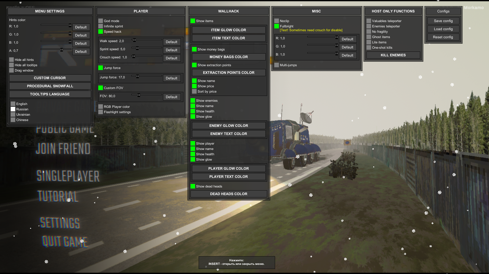
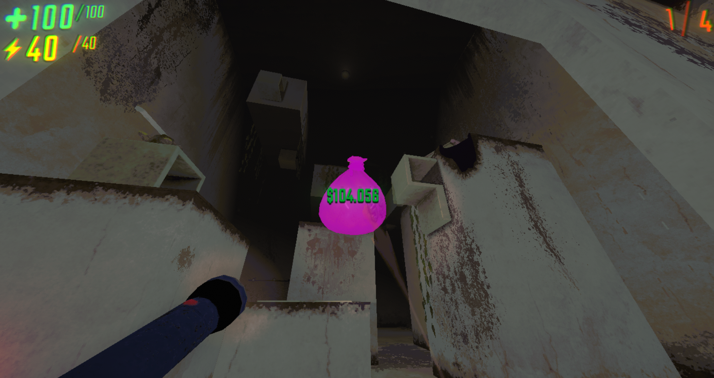
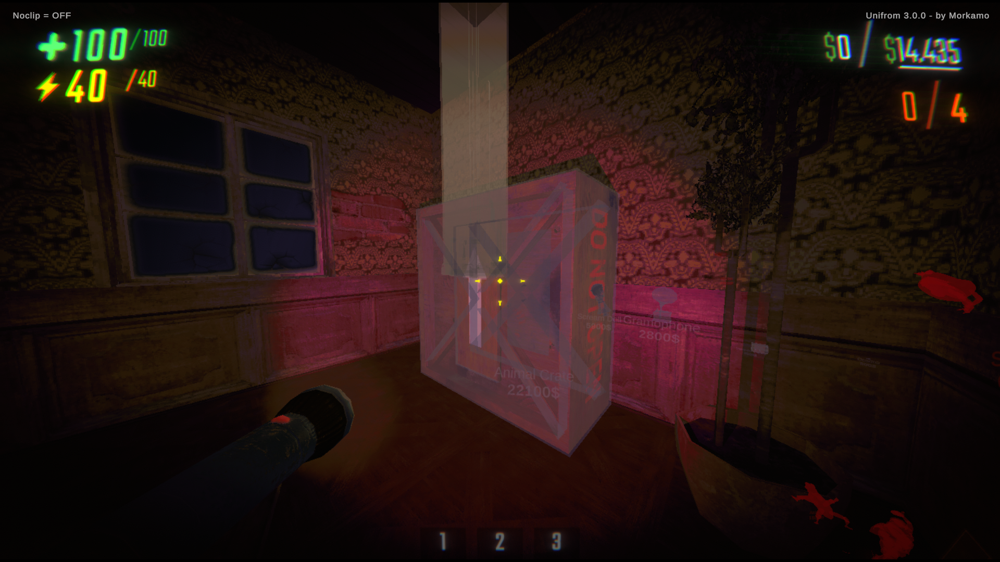

# Unifrom 1.0.0 (Cheat mod for R.E.P.O)
------------------------------------------
```
Прямое инжектирование (без BeplnEx)
```
- Перед скачиванием отключите любые антивирусы! (Они не дадут скачать инжектор)
1) Перед инжектом чита переместите все библиотеки из папки "libs" в папку библиотек игры. Она находиться в коренной папке игры по этому пути - "...\REPO\REPO_Data\Managed".
2) Запустите игру и дождитесь главного меню. (на фоне не должно быть открыто отладчиков или декомпиляторов, по типу "dnSpy" и прочих, их палит инжектор и откажется работать)
3) После чего откройте "SharpMonoInjector.Gui" (если не открывается, отключите антивирусы и скачайте заново, если не помогло, то вам необходимы .NET Core или .NET framework компоненты)
4) В инжекторе нажмите на кнопку "Refresh" для поиска процесса и выберете "REPO" в списке, если вдруг у вас выбрался другой. После чего введите в "Class name" -> Loader, а в "Method name" -> Load. (подробно на скриншоте)
5) Нажмите inject и в случае успеха в углу внизу будет вывод: "Status: Injection successful"
------------------------------------------

<b>ДИСКЛЕЙМЕР</b>
------------------------------------------
Данный проект создан исключительно в образовательных целях для изучения принципов разработки программного обеспечения, работы игровой механики и API. Автор не несёт ответственности за любое несанкционированное использование данного ПО. Пользователи несут полную ответственность за использование данного ПО. Автор не гарантирует, что использование программы не нарушит правила игры или лицензионные соглашения, установленные разработчиками. ПО предоставляется "как есть" без каких-либо гарантий, явных или подразумеваемых. Автор не поощряет использование программы для обхода защит, нарушения правил или нанесения ущерба третьим лицам. Перед использованием убедитесь, что это соответствует правилам и условиям использования игры. Использование данного ПО для коммерческой выгоды строго запрещено!






